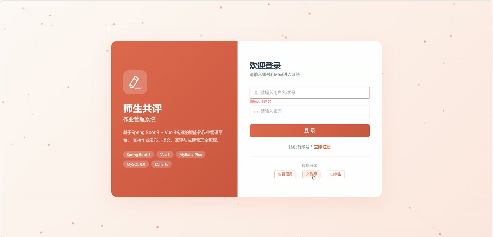
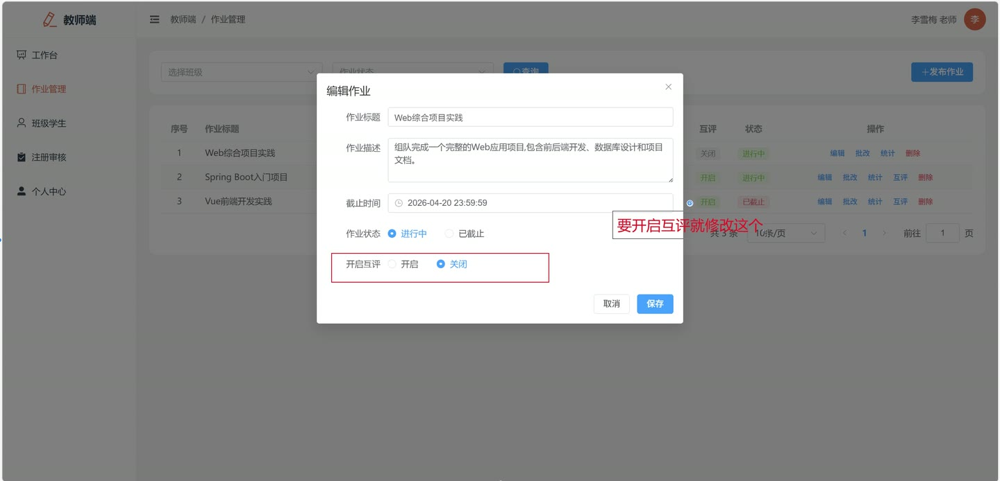
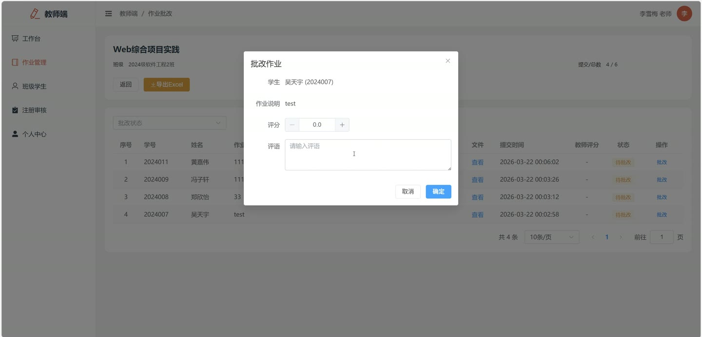
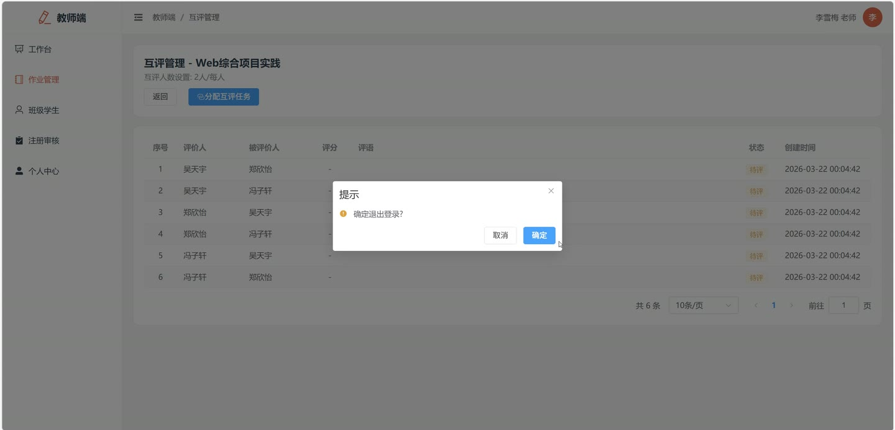
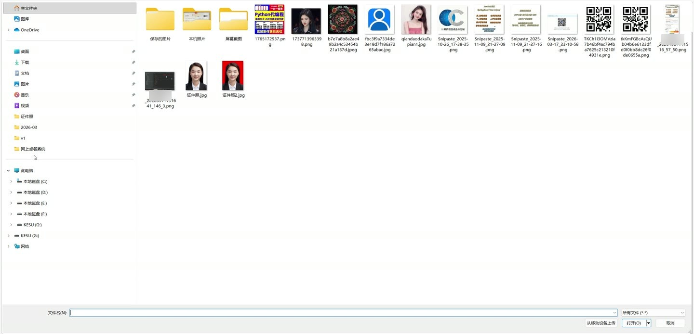
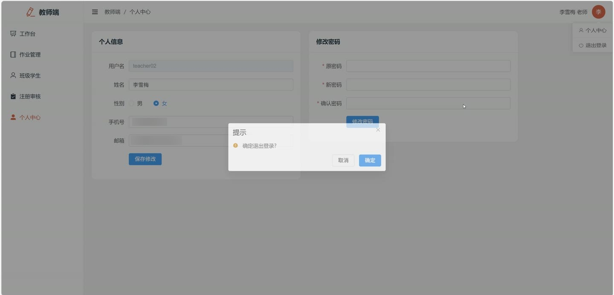

# (附文档)Springboot3+Vue3+MySQL 师生共评作业管理系统

**技术栈**：Springboot3、Vue3、MySQL

### 系统简介

本系统是基于 Spring Boot 3 + Vue 3 + MySQL 构建的师生共评作业管理系统，采用前后端分离架构。系统包含管理员、教师、学生三种角色，支持作业发布与提交、教师批改、学生互评、成绩统计与导出、学生注册审核等完整流程，实现作业全生命周期的数字化管理。
 
### 核心功能
 
### 管理员端

 
- 用户管理：分页查询用户列表（支持按用户名/姓名/手机号关键字搜索及按角色筛选），排除管理员自身 
- 新增用户：填写用户名、密码、角色、班级等信息创建用户，自动加密密码并设置启用状态 
- 编辑用户：修改用户基本信息，支持重置密码（留空则不修改） 
- 删除用户：从数据库中彻底移除指定用户 
- 切换用户状态：一键启用/禁用用户账号，禁用后无法登录系统 
- 获取所有教师列表：返回所有状态为启用的教师用户，供班级分配使用 
- 班级管理：分页查询班级列表（支持按班级名称关键字搜索），自动显示对应教师姓名及班级内活跃学生人数 
- 新增班级：设置班级名称、所属教师等信息创建新班级 
- 编辑班级：修改班级名称或负责教师 
- 删除班级：仅当班级下无学生时允许删除，否则提示错误 
- 作业类型管理：分页查询作业类型列表（支持按类型名称关键字搜索） 
- 新增作业类型：输入类型名称，自动检查名称是否重复 
- 编辑作业类型：修改类型名称，自动排除自身检查重复 
- 删除作业类型：从数据库中移除指定作业类型 
- 系统日志查询：分页查看所有用户的操作日志（支持按用户名/操作内容关键字搜索），记录操作人、操作内容、请求方法、IP地址及时间
 
### 教师端

 
- 个人信息管理：修改个人真实姓名、手机号、邮箱等基本信息（不含密码） 
- 修改密码：输入原密码和新密码完成密码修改，需验证原密码正确性 
- 发布作业：填写作业标题、描述、类型、目标班级、截止时间，可选上传附件，支持设置是否开启互评及每人互评数量 
- 作业列表：分页查看自己发布的作业（支持按班级、状态筛选），显示每个作业的已提交人数/班级总人数 
- 作业详情：查看作业完整信息，包括类型名称、班级名称、截止时间、附件等 
- 编辑作业：修改已发布作业的标题、描述、截止时间、互评设置等字段 
- 删除作业：删除作业及其关联的所有学生提交记录 
- 查看提交列表：按作业查看所有学生的提交记录（支持按批改状态筛选），显示学生姓名、学号、提交内容、提交时间 
- 批改作业：为单个提交记录输入教师评分和评语，系统自动计算最终成绩（教师分70% + 互评均分30%） 
- 批量批改：同时为多个学生提交记录输入评分和评语，一次性提交 
- 分配互评任务：为已开启互评的作业随机分配互评目标（避免自评），每个学生分配指定数量的互评对象 
- 查看互评结果：分页查看某个作业的所有互评记录，显示评价人、被评人、评分、评语及状态 
- 查看学生被评记录：查看某个学生在指定作业中收到的所有互评评分与评语 
- 调整最终成绩：手动修改某个学生的最终成绩（覆盖自动计算结果） 
- 成绩统计：查看某个作业的成绩统计，包括平均分、最高分、最低分、已批改人数及分数段分布（90-100/80-89/70-79/60-69/0-59） 
- 导出Excel：将某个作业的成绩表导出为Excel文件，包含序号、学号、姓名、教师评分、互评均分、最终成绩、教师评语、提交时间 
- 仪表盘：查看个人教学概览，包括作业总数、进行中作业数、待批改提交数、负责班级数 
- 班级学生列表：查看自己负责班级的学生名单（仅显示状态启用的学生） 
- 学生注册审核：查看待审核学生列表（仅限自己负责班级的学生），支持审核通过或拒绝（拒绝必须填写理由）
 
### 学生端

 
- 个人信息管理：修改个人真实姓名、手机号、邮箱等基本信息（不含密码） 
- 修改密码：输入原密码和新密码完成密码修改 
- 作业列表：查看自己所在班级的所有作业（按发布时间倒序），显示作业标题、类型、截止时间、提交状态、已提交人数/班级总人数 
- 作业详情：查看作业完整信息，包括描述、附件、截止时间、互评设置等 
- 提交作业：填写作业内容（文本或文件上传），提交后状态为待批改 
- 修改提交：在教师未批改前可修改已提交的作业内容和文件 
- 撤回提交：在教师未批改前可撤回已提交的作业记录 
- 查看我的提交：查看自己在某个作业上的提交记录，包括提交内容、文件、教师评分、互评均分、最终成绩及教师评语 
- 获取互评任务：查看自己在某个作业上需要评价的同学列表，显示被评人提交的内容和文件 
- 提交互评：为分配的互评对象输入评分和评语，提交后更新被评人的互评平均分 
- 查看收到的互评：查看自己在某个作业上收到的所有匿名互评评分和评语（评价人信息隐藏） 
- 成绩概览：查看个人成绩汇总，包括总提交次数、已批改次数、平均分、最高分 
- 作业历史：分页查看所有历史提交记录，显示每次提交的作业标题、提交时间、批改状态及最终成绩
 
### 技术栈

 后端框架Spring Boot 3 ORMMyBatis-Plus 权限认证JWT（jjwt） 密码加密Spring Security Crypto（BCryptPasswordEncoder） 前端框架Vue 3 状态管理Pinia 构建工具Vite 数据库MySQL Excel导出Apache POI（XSSFWorkbook）
 
### 交付内容

 
- 后端完整源码 
- 前端完整源码 
- 数据库初始化脚本 
- 万字文档

## 界面展示

---

## 获取完整源码 + 万字文档

本仓库为项目介绍页。**完整前后端源码、数据库初始化脚本、万字项目文档**，请加微信 `kangkangcode`，或访问 [codekk.top](http://codekk.top) 获取。

可作课程设计 / 毕业设计参考，支持远程部署调试。